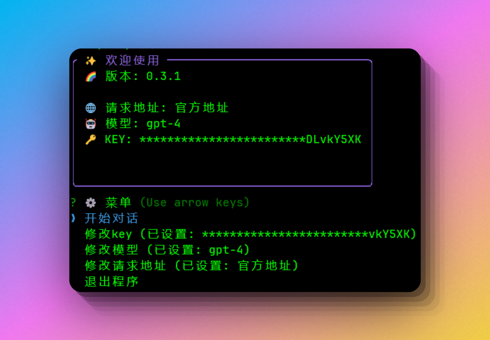

# ai-bot

基于openai的机器人

OpenAI-based robot

## 下载地址
[Releases](https://github.com/sjx1995/ai-bot/releases)

## 功能

- [x] 问答
- [x] 支持上下文
- [x] 自定义配置
- [x] 设置角色
- [x] 导出对话

## 截图

### 欢迎页

### 设置模型

### 设置角色

### 问答

##  更新日志

[CHANGELOG.md](CHANGELOG.md)
